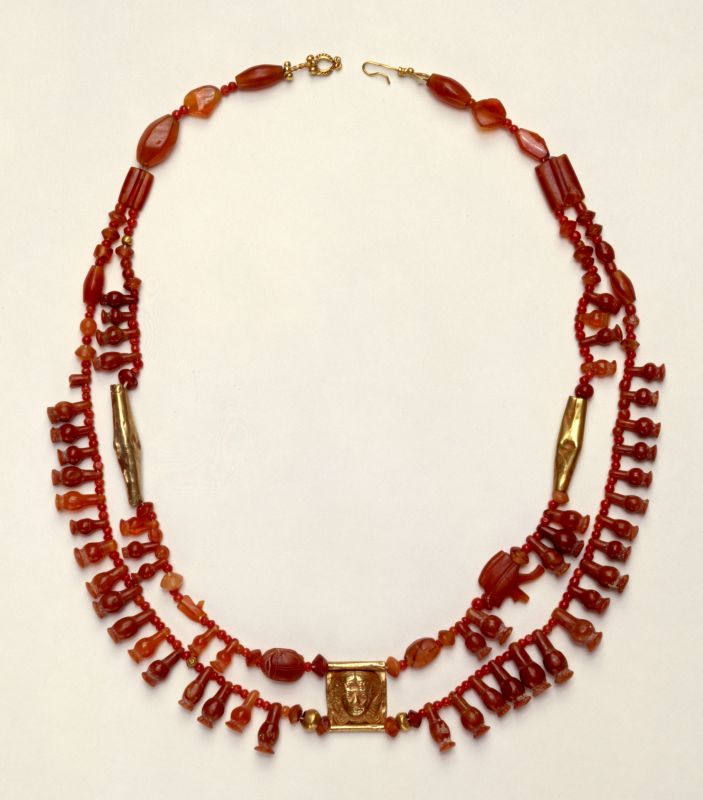

# 创世记第34章逐节注解、祷读

**【创卅四1】「利亚给雅各所生的女儿底拿出去，要见那地的女子们。」**

- 「出去」暗示底拿离开父母的保护和管教。「要见那地的女子们」可能是想看看当地女子的装扮（《犹太古史记》卷1第21章337节），见识一下世界。
- 底拿离开巴旦·亚兰时可能只有六、七岁（三十21），现在可能已经十四、五岁，因此本章的悲剧可能是雅各在示剑停留了几年之后发生的。雅各进入应许之地后没有直接去伯特利，而是停留在示剑城买地定居（三十三19），现在即将为这个停留付出惨痛的代价。

[

上图：主前1400-1200年迦南女子的项链，中间的金坠上刻的神像是埃及爱神哈索尔（Hathor）。现藏与耶路撒冷的以色列博物馆（ Israel Museum）。

**【创卅四2】「那地的主——希未人、哈抹的儿子示剑看见她，就拉住她，与她行淫，玷辱她。」**

底拿想出去「见」世面（1节），不料却被世界「看见」了。信徒固然不能把儿女养在温室里，但如果不能帮助儿女与神建立正常的关系，让儿女「出去」（1节）的结果必然是被世界「拉住」。「那地的主」指酋长之类的领袖人物。「希未人」是迦南的后代（十17），散住在迦南地（出三8）。

**【创卅四3】「示剑的心系恋雅各的女儿底拿，喜爱这女子，甜言蜜语地安慰她。」**

**【创卅四4】「示剑对他父亲哈抹说：『求你为我聘这女子为妻。』」**

本节原文是「给我聘这女子为妻」，并没有「求」字，表明示剑已经被父亲宠坏了。

**【创卅四5】「雅各听见示剑玷污了他的女儿底拿。那时他的儿子们正和群畜在田野，雅各就闭口不言，等他们回来。」**

**【创卅四6】「示剑的父亲哈抹出来见雅各，要和他商议。」**

**【创卅四7】「雅各的儿子们听见这事，就从田野回来，人人忿恨，十分恼怒；因示剑在以色列家做了丑事，与雅各的女儿行淫，这本是不该做的事。」**

「以色列家」这个词表明，这个家族清楚地知道自己与迦南人不同（申二十二21；耶二十九23）。「行淫」对于当时的迦南人来说是家常便饭，但在「以色列家」，「这本是不该做的事」。今天世人习以为常的所谓的主流文化、开放包容，对于神家的人也是「不该做的事」

**【创卅四8】「哈抹和他们商议说：『我儿子示剑的心恋慕这女子，求你们将她给我的儿子为妻。」**

**【创卅四9】「你们与我们彼此结亲；你们可以把女儿给我们，也可以娶我们的女儿。」**

信徒是分别为圣归于神的，但仇敌却千方百计地引诱我们与世界「彼此结亲」。本节两处「女儿」原文都是复数，可见雅各不只底拿一个女儿。哈抹提出的解决方法在古代苏美尔人、赫人和亚述人的法律中都可以看到，可能也是迦南人的惯例。

**【创卅四10】「你们与我们同住吧！这地都在你们面前，只管在此居住，做买卖，置产业。』」**

「只管在此居住，做买卖，置产业」就是邀请「以色列家」（7节）定居下来，这是许多寄居的人所求之不得的事。信徒「在世上是客旅，是寄居的」（来十一13），在天上「有更美长存的家业」（来十34），仇敌却千方百计地引诱我们一心留在世上经营、建造，「只管在此居住，做买卖，置产业」。

**【创卅四11】「示剑对女儿的父亲和弟兄们说：『但愿我在你们眼前蒙恩，你们向我要什么，我必给你们。」**

世界的门向着我们是大大敞开的，「因为引到灭亡，那门是宽的，路是大的，进去的人也多」（太七14）。仇敌为了把信徒从神那里掳走，甚至愿意付出本来就不属于牠的「世上的万国与万国的荣华」（太四8）。

**【创卅四12】「任凭向我要多重的聘金和礼物，我必照你们所说的给你们；只要把女子给我为妻。』」**

「聘金」指男方给女方父母的聘礼。「礼物」指女方父母给新娘的嫁妆。努斯文献（Nuzi Texts）记载典型的聘金大约是30-40舍客勒银子，相当于一个雇工3年的工资。哈抹和示剑没有道歉，只是在谈买卖，他们认为用钱可以买到一切。

**【创卅四13】「雅各的儿子们因为示剑玷污了他们的妹子底拿，就用诡诈的话回答示剑和他父亲哈抹，」**

雅各一生「诡诈」，经过了毗努伊勒才被神改变了。但雅各的儿子们从小耳濡目染，现在却自然流出了「诡诈」。神绝不会放过祂所拣选的人生命深处的残缺，雅各一生「诡诈」（二十七35），神不但用拉班的「诡诈」让他体会到罪的可憎（三十一41），也用他儿子们的「诡诈」让他体会到罪会遗传（三十七31-33）。所以「不要自欺，神是轻慢不得的。人种的是什么，收的也是什么」（加六7）。

**【创卅四14】「对他们说：『我们不能把我们的妹子给没有受割礼的人为妻，因为那是我们的羞辱。」**

亚伯拉罕家族的所有男孩在出生后第八天都必须行割礼，作为神与他们立约的记号（十七9-14）。

**【创卅四15】「惟有一件才可以应允：若你们所有的男丁都受割礼，和我们一样，」**

雅各的儿子们用神所赐的「割礼」作为欺骗的工具，不但欺骗了人，也亵渎了神，是「以敬虔为得利的门路」（提前六5）。

**【创卅四16】「我们就把女儿给你们，也娶你们的女儿；我们便与你们同住，两下成为一样的人民。」**

**【创卅四17】「倘若你们不听从我们受割礼，我们就带着妹子走了。』」**

**【创卅四18】「哈抹和他的儿子示剑喜欢这话。」**

**【创卅四19】「那少年人做这事并不迟延，因为他喜爱雅各的女儿；他在他父亲家中也是人最尊重的。」**

**【创卅四20】「哈抹和他儿子示剑到本城的门口，对本城的人说：」**

古代城市房屋拥挤、街道窄小，只有空旷的城门口适合公众聚集，人们常在那里处理财产买卖和诉讼案件（二十三10），并举行公开集会。

上图：示剑城遗址Tell Balata，已有5000多年历史。

**【创卅四21】「『这些人与我们和睦，不如许他们在这地居住，做买卖；这地也宽阔，足可容下他们。我们可以娶他们的女儿为妻，也可以把我们的女儿嫁给他们。」**

**【创卅四22】「惟有一件事我们必须做，他们才肯应允和我们同住，成为一样的人民：就是我们中间所有的男丁都要受割礼，和他们一样。」**

**【创卅四23】「他们的群畜、货财，和一切的牲口岂不都归我们吗？只要依从他们，他们就与我们同住。』」**

示剑城居民的真实目的，是要同化「以色列家」（7节），把他们连人带财一起夺去。在历史上，世界有时掺杂一大堆形式上「受割礼」的假信徒进入教会，有时则打着博爱包容的旗号邀请教会与他们「同住」，目的都是为了同化教会、掳掠教会，夺走我们「更美长存的家业」（来十34）。

**【创卅四24】「凡从城门出入的人就都听从哈抹和他儿子示剑的话；于是凡从城门出入的男丁都受了割礼。」**

迦南地有许多民族都行割礼，用于成人仪式、丰饶崇拜、结婚仪式等，所以示剑居民对割礼并不觉得奇怪。雅各的财富是吸引示剑居民受割礼的主要原因。

**【创卅四25】「到第三天，众人正在疼痛的时候，雅各的两个儿子，就是底拿的哥哥西缅和利未，各拿刀剑，趁着众人想不到的时候来到城中，把一切男丁都杀了，」**

割礼手术会使成人失去活动能力几天。「西缅和利未」是底拿的同母哥哥，此时年纪20岁左右，他们以恶报恶、以暴易暴，这种残忍的报复行为导致后代被分散居住（四十九5-7）。

**【创卅四26】「又用刀杀了哈抹和他儿子示剑，把底拿从示剑家里带出来就走了。」**

**【创卅四27】「雅各的儿子们因为他们的妹子受了玷污，就来到被杀的人那里，掳掠那城，」**

「受了玷污」原文是复数，表明雅各的儿子们认为该城的男子都与底拿的被玷污有分。

**【创卅四28】「夺了他们的羊群、牛群，和驴，并城里田间所有的；」**

**【创卅四29】「又把他们一切货财、孩子、妇女，并各房中所有的，都掳掠去了。」**

雅各的儿子们不但谋杀，并且抢劫，残忍加上贪婪，罪加一等。「私欲既怀了胎，就生出罪来；罪既长成，就生出死来」（雅一15），我们若不从起头就消除罪念，罪行就会越演越烈。

**【创卅四30】「雅各对西缅和利未说：『你们连累我，使我在这地的居民中，就是在迦南人和比利洗人中，有了臭名。我的人丁既然稀少，他们必聚集来击杀我，我和全家的人都必灭绝。』」**

- 雅各此时心中所顾念的只是家族的名声和安危，表明他还没有认识到自己在神旨意上的亏欠，也没有看到这事背后神的手。示剑的悲剧，实际上是神用「鞭打」的方式来催逼雅各「上伯特利去」，「因为主所爱的，祂必管教，又鞭打凡所收纳的儿子」（来十二5），「凡管教的事，当时不觉得快乐，反觉得愁苦，后来却为那经练过的人结出平安的果子，就是义」（来十二11）。
- 雅各还没有真正领会神呼召他的目的，所以「平平安安地到了迦南地的示剑城」（三十三18）就满足了，放松地停留在「这地的居民中」，没有继续「上伯特利去」（三十五1），结果酿成了这场悲剧。我们也常常和雅各一样，蒙召之后「平平安安地到了迦南地的示剑城」就满足了，从此忙着在「示城剑」经营地上的产业，等儿女出了问题，只知道责备，却不知反省自己不应该停留在「示城剑」，而应该带领儿女「上伯特利去」、走完神要我们所走的路。

**【创卅四31】「他们说：『他岂可待我们的妹子如同妓女吗？』」**

- 既然雅各从人的角度来考虑是非得失（30节），他的儿子们也同样用人的理由来为自己开脱。示剑对底拿先是「玷辱」（2节），后是禁锢在家（26节），确实如同对待妓女，雅各儿子们的行为也貌似伸张公义。所以一时间雅各竟然无言以对，在家中失去了权威。
- 我们若根据人的道理，每个人都能为自己的行为找到振振有词的理由，谁也不能服谁。所以有属灵智慧的父母不应该用人的道理来教育儿女，而应该单单根据神清楚启示的真理。
- 在罪恶面前忍气吞声、息事宁人，固然不是神所悦纳的；但凭血气行事，以恶行善、不择手段，也是神所憎恶的。因此我们应当求圣灵光照我们，鉴察我们的动机是否真正根据神，方法是否真正倚靠神，目的是否真正归于神。
- 神已经把雅各的所是和所作借着他舅舅拉班照样做在他的身上，让他认识自己的本相是何等可憎；现在神又把雅各的所是和所作借着他儿子们照样做在他的身上，让他体验人凭着自己的后果是何等可怕。在这更深的拆毁面前，雅各已经不能像几年前在基列山「发怒斥责拉班」那样大发雷霆（三十一36-42），而是无言以对，默默地接受、思想这个事实。