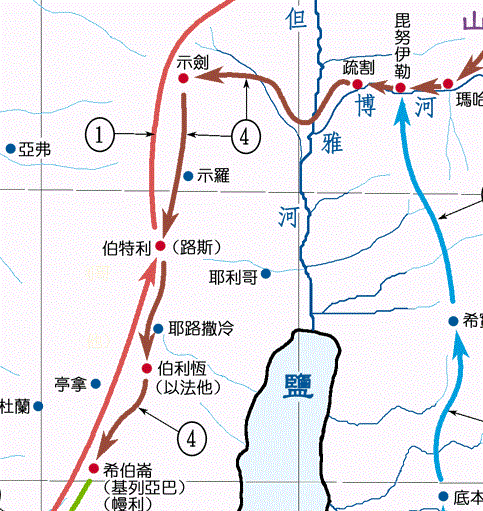

# 创世记第35章逐节注解、祷读

**【创卅五1】「神对雅各说：『起来！上伯特利去，住在那里；要在那里筑一座坛给神，就是你逃避你哥哥以扫的时候向你显现的那位。』」**

- 在上一章示剑城的悲剧里完全没有提到神的名字（三十四1-31），但本章却10次提到「神」，表明是神兴起了示剑城的环境，把雅各对付到在儿子的反驳面前无言以对的地步（三十四31），然后才向他说话。神要借着这事让雅各认识到人凭着自己是何等可怕，体验到没有按神心意行走的后果，要把他逼回到起初向神所许的愿里去（二十八20-22）。
- 这是神第一次主动吩咐人「筑一座坛给神」，表明雅各在示剑城所筑的那座坛实在不能满足神的心意。虽然雅各给那座坛起名叫「伊利·伊罗伊·以色列（就是神、以色列神的意思）」（三十三20），但神却还是自称「你逃避你哥哥以扫的时候向你显现的那位」，因为神实际上还没有完全成为以色列的神，神在雅各的心中和家里并没有得着当有的地位。
- 我们也常常在跟随神的过程中岔出去走了自己的路，停留在安逸的「示剑城」，离弃了向着神「起初的爱心」（启二4），筑起一座让自己安于现状的示剑之坛。然而人会忘记自己当初向神所许的愿，神却不会忘记，凡是祂所拣选的人，祂一定会催逼我们「上伯特利去，住在那里；要在那里筑一座坛给神」。
- 伯特利的地势比示剑城高，所以神说「上伯特利去」，而在属灵的实际上也是如此。

**【创卅五2】「雅各就对他家中的人并一切与他同在的人说：『你们要除掉你们中间的外邦神，也要自洁，更换衣裳。」**

**【创卅五3】「我们要起来，上伯特利去，在那里我要筑一座坛给神，就是在我遭难的日子应允我的祷告、在我行的路上保佑我的那位。』」**

- 雅各在神的光照下苏醒了，他不再是无言以对（三十四31），也不再用人的道理来与儿女争辩（三十四30），而是用神的话语来带领全家，重新带领全家走上神要他所走的路。「我们要起来，上伯特利去」，成为每个信徒属灵复兴的座右铭。
- 我们若要与神恢复正常的关系，首先就要「除掉你们中间的外邦神，也要自洁」（2节），因为「非圣洁没有人能见主」（来十二14）。约书亚后来也在示剑要求以色列人「现在要除掉你们中间的外邦神，专心归向耶和华以色列的神」（书二十四23）。

**【创卅五4】「他们就把外邦人的神像和他们耳朵上的环子交给雅各；雅各都藏在示剑那里的橡树底下。」**

- 当雅各接受神在心里完全作主的时候，就不再讲人的道理（三十四30），而是只说神的话语（2-3节）。这时神的权柄就显出来了，他的妻儿不再争辩（三十四31），而是毫无异议地顺服他。我们自己首先顺服神、照着神的话语去说话行事，才能流露出属灵的影响力，带领、影响儿女和四周的人。
- 「外邦人的神像」可能包括拉结偷窃的拉班家的神像（三十一19）和雅各众子在示剑城掳掠的神像（三十四29）。我们若在「示剑城」停留久了，许多人、事、物就会不知不觉在我们心中成为取代真神的偶像，这时神就会兴起环境来显明我们里面隐藏的偶像。
- 「耳朵上的环子」可能刻着偶像或与偶像有关的图案，甚至就是护身符（何二13），连耳环都除掉，是对偶像彻底的对付。今天许多信徒佩戴的首饰和家中装饰品上面的艺术形象，也都是来自异教的神话传说。

上图：主前7-6世纪的腓尼基耳环。上面的双头鹰形象是模仿古埃及爱神哈索尔（Hathor）的宽领子。

上图：示剑东面Mount Kabir山上的橡树。橡树茂密（结六13）、坚固（摩二9），常被作为当地的地标（创十二6；十三18；三十五8；书十九33；撒上十3）。迦南人常在橡树下敬拜偶像（赛五十七5；何四13）。

**【创卅五5】「他们便起行前往。神使那周围城邑的人都甚惊惧，就不追赶雅各的众子了。」**

人若拣选神的道路，除掉一切偶像（4节），神就负人一切的责任，「使那周围城邑的人都甚惊惧」，因为神自己应许「我必与你同在」（三十一3）。人若选自己的道路，靠自己的血气和「刀剑」（三十四25），只能等着「我和全家的人都必灭绝」（三十四30）。

**【创卅五6】「于是雅各和一切与他同在的人到了迦南地的路斯，就是伯特利。」**

**【创卅五7】「他在那里筑了一座坛，就给那地方起名叫伊勒·伯特利（就是伯特利之神的意思）；因为他逃避他哥哥的时候，神在那里向他显现。」**

「伯特利」原文字义是「神的家」。雅各在示剑称神是「以色列的神」（三十三20），现在称神是「伯特利之神」，表明现在神不只是他个人的神，更是这个属灵团体的神，是「神的家的神」。

上图：19世纪的伯特利遗址（现名Beitin）照片。

**【创卅五8】「利百加的奶母底波拉死了，就葬在伯特利下边橡树底下；那棵树名叫亚伦·巴古。」**

- 利百加此时可能已经去世，「利百加的奶母底波拉」可能是从希伯伦赶来接雅各的，她应该是最宠爱雅各的人了，但神也将她取走，如同神像和耳环一样埋葬在「橡树底下」（4节）。神要从雅各身边取走从人来的一切同情、安慰和照顾。
- 「底波拉」字义是「蜜蜂」。「亚伦·巴古」字义是「哭泣的橡树」，表明雅各的伤痛和对底波拉的尊敬。

**【创卅五9】「雅各从巴旦·亚兰回来，神又向他显现，赐福与他，」**

**【创卅五10】「且对他说：『你的名原是雅各，从今以后不要再叫雅各，要叫以色列。』这样，他就改名叫以色列。」**

神在毗努伊勒把雅各改名叫「以色列」（三十二28），现在神再次确认「从今以后不要再叫雅各，要叫以色列」，表明雅各天然生命被对付的经历从毗努伊勒开始，到伯特利已经告一段落。从今以后，他要离弃旧人「雅各」，只凭新人「以色列」而活。

**【创卅五11】「神又对他说：『我是全能的神；你要生养众多，将来有一族和多国的民从你而生，又有君王从你而出。」**

**【创卅五12】「我所赐给亚伯拉罕和以撒的地，我要赐给你与你的后裔。』」**

神当初把**「**亚伯兰**」**改名成**「**亚伯拉罕**」**的时候（十七5），用「全能的神」来启示自己（十七1），现在祂把**「**雅各**」**改名成**「**以色列**」（10节）**，也用「全能的神」（11节）来启示自己。神用「以色列」这个新名重新坚定了当初给亚伯拉罕的「国度」、「君王」和「后裔」的应许（十七6-7）。

**【创卅五13】「神就从那与雅各说话的地方升上去了。」**

「升上去」表明神当时借着可见的形像对雅各讲话。

**【创卅五14】「雅各便在那里立了一根石柱，在柱子上奠酒，浇油。」**

雅各在伯特利第一次遇见神是「浇油」奉献（二十八16-18），现在第二次遇见神更加上表达喜乐的「奠酒」。雅各从此真正地把神当作自己的神、自己的主，里面充满了喜乐。

**【创卅五15】「雅各就给那地方起名叫伯特利。」**

**【创卅五16】「他们从伯特利起行，离以法他还有一段路程，拉结临产甚是艰难。」**

**【创卅五17】「正在艰难的时候，收生婆对她说：『不要怕，你又要得一个儿子了。』」**

**【创卅五18】「她将近于死，灵魂要走的时候，就给她儿子起名叫便·俄尼；他父亲却给他起名叫便雅悯。」**

- 「便·俄尼」的字义是「我的悲伤之子」，意思是说他一出生就没有母亲，是一个苦命的儿子。
- 「便雅悯」的字义是「右手之子」，希伯来人以右手为尊贵，右边也代表南方，因此「右手之子」又有「生于南方」或「尊贵之子」的意思。
- 雅各其他儿子的名字都是他们的母亲起的，但是当神把雅各最爱的拉结取走的时候，雅各「却给他起名叫便雅悯」。雅各交出了自己的偶像（4节），走过了神要他走的路（6节），筑起了神所要的坛（7节），从此「心意更新而变化」（罗十二2），借着「便雅悯」这个名字表明他真真正正地把前途交托给神了，不再靠自己谋算。
- 「拉结哭她儿女，不肯受安慰」从此成了以色列人的一句谚语（耶三十一15；太二18）。

**【创卅五19】「拉结死了，葬在以法他的路旁；以法他就是伯利恒。」**

- 神取走拉结，可能因为雅各爱拉结甚深，以致成了他心中的偶像，也可能是对雅各草率咒诅的管教（三十一32）。
- 「以法他」是「伯利恒」的古名，在摩西写本书之前已改称「伯利恒」，是大卫的家乡、主耶稣诞生的地方。
- 拉结「葬在以法他的路旁」，但后来便雅悯人可能将拉结的骸骨移葬到他们境内离泄撒不远的地方（撒上十2），靠近拉玛（耶三十一15）。

上图：伯利恒（以法他），位于耶路撒冷南方约8公里，希伯伦东北约22公里，海拔880米。城郊的土壤肥沃，出产丰富，是主耶稣出生的地方。主后388年，早期教父耶柔米定居于伯利恒，在这里完成了著名的武加大（Vulgate）拉丁文圣经译本。

**【创卅五20】「雅各在她的坟上立了一统碑，就是拉结的墓碑，到今日还在。」**

「一统碑」意思是一块记念的石柱。「今日」就是摩西写摩西五经的时候。雅各的一生立了四根柱子：

1. 第一根：见证神的应许（二十八18）。
2. 第二根：脱离巴旦·亚兰（三十一45）。
3. 第三根：真正接受神为自己的神（三十五14）。
4. 第四根：告别自己在地上的最爱（三十五20）。

上图：拉结墓（Rachel’s Tomb），位于在伯利恆以北约两公里处公路的右侧，从主后4世纪开始用来纪念拉结，但不一定是真实地点。目前的建筑始于奥斯曼帝国时期，1841年重修。

**【创卅五21】「以色列起行前往，在以得台那边支搭帐棚。」**

「以得台」字义是「羊群之塔」，可能在伯利恒南方，地点不详。

**【创卅五22】「以色列住在那地的时候，流便去与他父亲的妾辟拉同寝，以色列也听见了。雅各共有十二个儿子。」**

- 流便与「拉结的使女辟拉」（三十7）同寝，可能是为了阻止她取代拉结，也可能是为了夺取家中的领导地位，结果失去了长子的名分（代上五1）。古时外邦人承受父亲产业的长子也可拥有父亲的妾（撒下十六22；王上二22），这种乱伦行为被摩西律法所禁止（利十八8-9；申二十二30）。
- 这事是雅各从前在家中忽略属灵见证的后果。借着这事，雅各「力量强壮的时候生的，本当大有尊荣，权力超众」（四十九3）的长子也被神取走了。

**【创卅五23】「利亚所生的是雅各的长子流便，还有西缅、利未、犹大、以萨迦、西布伦。」**

**【创卅五24】「拉结所生的是约瑟、便雅悯。」**

**【创卅五25】「拉结的使女辟拉所生的是但、拿弗他利。」**

**【创卅五26】「利亚的使女悉帕所生的是迦得、亚设。这是雅各在巴旦·亚兰所生的儿子。」**

- 虽然神取走了拉结，但应允了她「愿耶和华再增添我一个儿子」（三十24）的祷告，完整的以色列十二支派在神的拆毁中被建立了。
- 在圣经中，「十二」成为代表神的百姓以色列整体的象征数目，旧约有十二支派，新约有十二使徒（启二十一12、14）。
- 「在巴旦·亚兰所生的儿子」是概说，因为便雅悯是在迦南地出生的（18节）。

**【创卅五27】「雅各来到他父亲以撒那里，到了基列·亚巴的幔利，乃是亚伯拉罕和以撒寄居的地方；基列·亚巴就是希伯仑。」**

- 「希伯仑」是亚伯拉罕、以撒晚年居住的地方，是大卫作王之地，是神显明祂的荣耀和权柄的地方，也是雅各应当承受父亲产业的地方。
- 神的拆毁是为了充满，祂拿掉我们里面不该有的东西，把地位腾出来，是要用祂自己来充满。从巴旦·亚兰到希伯仑的一路上，神拿掉了雅各的力量（三十二31），拿掉了他的自爱（三十三3），拿掉了他的安居生活（三十三19），拿掉了他在迦南人中的好名声（三十四30），拿掉了他全家的偶像（三十五2），拿掉了最安慰他的奶母（8节），拿掉了他最心爱的妻子（19节），拿掉了他最倚重的长子（22节），最后拿掉了他最宠爱的约瑟（三十七33）。雅各在神所指示的路上每走一步，就被神拿掉一些，又被神增添一些，就这样一路走走停停，没有定居在示剑，也没有定居在伯特利，而是一直走到神要他去的「你祖、你父之地」（三十一3）。

上图：雅各从示剑沿迦南中央山地的道路向南，经过伯特利、以法他（伯利恒），回到希伯伦。

**【创卅五28】「以撒共活了一百八十岁。」**

**【创卅五29】「以撒年纪老迈，日子满足，气绝而死，归到他列祖（原文是本民）那里。他两个儿子以扫、雅各把他埋葬了。」**

- 以撒在雅各定居在希伯仑，并且约瑟被卖后12年才去世（三十七2、14），这时雅各120岁，大约是在主前1887年。「一百八十岁」是圣经记载洪水以后最长的寿命。
- 雅各最宠爱的约瑟被卖以后（三十七28），他已经被神完全拆毁，一切阻挡他承受神应许的人、事、物都被神拿走了：「除祢以外，在天上我有谁呢？除祢以外，在地上我也没有所爱慕的。我的肉体和我的心肠衰残；但神是我心里的力量，又是我的福分，直到永远」（诗七十三25-26）。这时神就让以撒歇了地上的工，让雅各接上以撒作神的见证人，接上神荣耀的计划。以撒去世后的第二年，约瑟30岁就在埃及被高升（四十一46），神开始将极大的权柄和丰富加在以色列家，直到神的荣耀和旨意在雅各身上完全彰显出来（四十七7；四十九1-28）。
- 以扫和雅各一起把父亲埋在麦比拉洞（四十九1）。无论人怎样诡诈、怎样仇恨，神都有办法改变他们，「人所行的，若蒙耶和华喜悦，耶和华也使他的仇敌与他和好」（箴十六7），好让祂所拣选的人荣耀地承受应许。
- 以撒的一生是平平淡淡，雅各的一生却是大起大落；以撒看起来是懦弱普通，雅各却是精明能干。然而这两个人都能被神拣选承受神的应许，因为神在他们身上所要做的，不是根据他们自己的光景，也不在于他们为神做了什么，而在于神自己的定意。
- 神在以撒身上要显明的是一个懂得承受应许的人，只要站对了儿子的地位，就可以承受父亲所有的一切。神在雅各身上要显明的是一个被神拆毁又建造的人，从一个彻底败坏的人，被神恢复成盛满神荣耀的器皿。