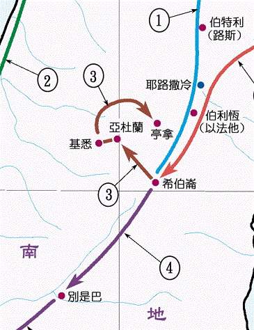
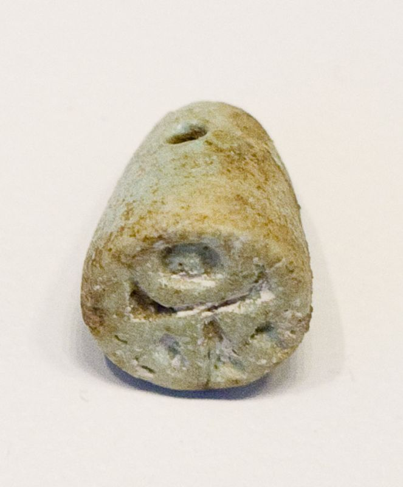
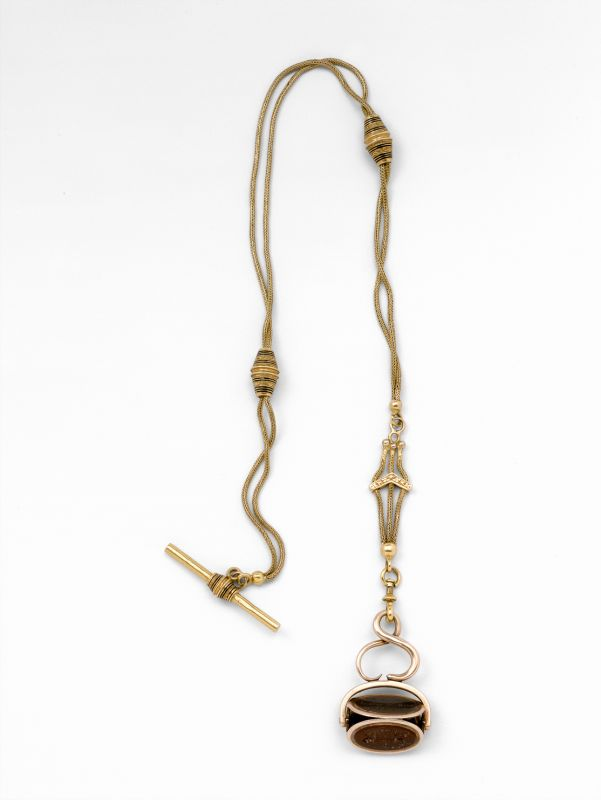

# 创世记第38章逐节注解、祷读

**【创卅八1】「那时，犹大离开他弟兄下去，到一个亚杜兰人名叫希拉的家里去。」**

**【创卅八2】「犹大在那里看见一个迦南人名叫书亚的女儿，就娶她为妻，与她同房，」**

- 「那时」指约瑟被卖到埃及的时候，犹大可能比约瑟大3岁，此时大约20岁。他离家与迦南人生活在一起，无论是信仰、道德和家庭都遇到了极大的难处。
- 「亚杜兰」原文意思是「人的正义」，「亚杜兰」比希伯仑海拔低，所以说「下去」；「希拉」原文意思是「高贵的家庭」；「书亚」原文意思是「财富」。这一幕场景正好表明了犹大的属灵实际：他卖了约瑟以后，自己也迷失了方向，离开了父家，一路走下坡路，到人中间去寻求「正义」、「地位」和「财富」。
- 「亚杜兰」位于希伯仑西北约24公里，后来属于犹大支派（代下十一5、7），因大卫藏身「亚杜兰洞」而出名（撒上二十二1）。
- 雅各在长子流便（三十五22）、次子西缅、三子利未（三十四30）都堕落之后，又看到四子犹大的远离。虽然雅各已经悔改，但还要继续承受罪的结果，因为神对雅各的拆毁一定要「直拆到根基」（诗一百三十七7）。

**【创卅八3】「她就怀孕生了儿子，犹大给他起名叫珥。」**

**【创卅八4】「她又怀孕生了儿子，母亲给他起名叫俄南。」**

**【创卅八5】「她复又生了儿子，给他起名叫示拉；她生示拉的时候，犹大正在基悉。」**

「基悉」原文意思是「错误的」，可能是双关语，因为犹大对「示拉」的婚姻安排是「错误的」（26节）。

**【创卅八6】「犹大为长子珥娶妻，名叫她玛。」**

「她玛」原文意思是棕榈树。

**【创卅八7】「犹大的长子珥在耶和华眼中看为恶，耶和华就叫他死了。」**

**【创卅八8】「犹大对俄南说：『你当与你哥哥的妻子同房，向他尽你为弟的本分，为你哥哥生子立后。』」**

当时的习俗是，如果哥哥死了没有儿子，弟弟应当娶嫂子为妻，所生长子归于哥哥名下，使哥哥的产业有儿子可以继承。这习俗后来被摩西律法所确认（申二十五5-6）。

**【创卅八9】「俄南知道生子不归自己，所以同房的时候，便遗在地，免得给他哥哥留后。」**

**【创卅八10】「俄南所做的，在耶和华眼中看为恶，耶和华也就叫他死了。」**

俄南故意不「给他哥哥留后」（9节），这样他就可以占有哥哥的那份遗产。

**【创卅八11】「犹大心里说：『恐怕示拉也死，像他两个哥哥一样』，就对他儿妇她玛说：『你去，在你父亲家里守寡，等我儿子示拉长大。』她玛就回去住在她父亲家里。」**

犹大可能觉得她玛「克夫」，所以「恐怕示拉也死，像他两个哥哥一样」。示拉后来并没有死（代上四21）。犹大要求她玛回去守寡而不是改嫁，表示答应将让示拉娶她，但却没有信守诺言。

**【创卅八12】「过了许久，犹大的妻子书亚的女儿死了，犹大得了安慰，就和他朋友亚杜兰人希拉上亭拿去，到他剪羊毛的人那里。」**

- 「得了安慰」原意是「哀丧期过后」。
- 「剪羊毛」通常在三月初、母羊生小羊之前一个月进行，这样可以刺激母羊多吃草，羊毛也可以在夏季重新长出来，好在冬季御寒。牧人将羊群集中在一个地点剪羊毛，羊毛也在此处加工、染色，并织成布料，剪完羊毛后会有庆祝的筵席（撒上二十五4、11、36；撒下十三23-25）。
- 这事可能是在犹大40岁左右发生的，大约是埃及七个丰年结束的时候。

上图：犹大离开希伯仑后，在亚杜兰、基悉、亭拿一带生活。

**【创卅八13】「有人告诉她玛说：『你的公公上亭拿剪羊毛去了。』」**

**【创卅八14】「她玛见示拉已经长大，还没有娶她为妻，就脱了她作寡妇的衣裳，用帕子蒙着脸，又遮住身体，坐在亭拿路上的伊拿印城门口。」**

**【创卅八15】「犹大看见她，以为是妓女，因为她蒙着脸。」**

- 她玛显然了解犹大不是一个敬畏神的人。如果犹大像约瑟那样害怕「得罪神」（三十九9），她玛的计谋就不能成功。但犹大并不敬畏神，他连弟弟都能卖掉，在道德上更是毫无底线。
- 「作寡妇的衣裳」古代的寡妇有特别的装饰表明身份。当时的寡妇和已婚妇女都不蒙脸，而妓女会像新娘一样「用帕子蒙着脸」。

**【创卅八16】「犹大就转到她那里去说：『来吧！让我与你同寝。』他原不知道是他的儿妇。她玛说：『你要与我同寝，把什么给我呢？』」**

**【创卅八17】「犹大说：『我从羊群里取一只山羊羔打发人送来给你。』她玛说：『在未送以先，你愿意给我一个当头吗？』」**

「当头」就是「抵押品」。

**【创卅八18】「他说：『我给你什么当头呢？』她玛说：『你的印、你的带子，和你手里的杖。』犹大就给了她，与她同寝，她就从犹大怀了孕。」**

「印」是个人的图章，「带子」用于把印挂在脖子，「杖」是牧羊人的工具，有身分的人杖上刻着独特的花纹，可以作为信物。

上图：主前8-6世纪的印，可以用带子穿起来。现藏于以色列博物馆。

**【创卅八19】「她玛起来走了，除去帕子，仍旧穿上作寡妇的衣裳。」**

**【创卅八20】「犹大托他朋友亚杜兰人送一只山羊羔去，要从那女人手里取回当头来，却找不着她，」**

**【创卅八21】「就问那地方的人说：『伊拿印路旁的妓女在那里？』他们说：『这里并没有妓女。』」**

**【创卅八22】「他回去见犹大说：『我没有找着他，并且那地方的人说：“这里没有妓女。”』」**

15节的「妓女 zanah」原文有「行淫 」的意思，指普通的妓女。光顾普通的妓女，即使在迦南人中间也是不光彩的行为。而21-22节的「妓女 qĕdeshah」原文是「庙妓」，迦南人在敬拜偶像的仪式上与「庙妓」行淫，不但不以为耻，反而认为是虔诚的宗教行为。犹大让他的朋友去找「庙妓」而不是「妓女」，目的是为了掩饰自己的不光彩行为，其实他的道德水平连迦南人都不如了。

**【创卅八23】「犹大说：『我把这山羊羔送去了，你竟找不着她，任凭她拿去吧，免得我们被羞辱。』」**

「免得我们被羞辱」，是因为担心四处寻找妓女的过程中，会使犹大的名誉受损。凡是不敬畏神的人，也都是只看重在人面前的名声，却不顾自己在神面前的良心。

**【创卅八24】「约过了三个月，有人告诉犹大说：『你的儿妇她玛作了妓女，且因行淫有了身孕。』犹大说：『拉出她来，把她烧了。』」**

- 才「过了三个月」，犹大不但忘了自己曾经「行淫」，还自以为义地要惩罚儿媳妇的「行淫」。世人不是不知道罪和公义，而是采取双重标准：以公义挑剔别人，以慈爱宽容自己。但神的标准却是：「你们用什么量器量给人，也必用什么量器量给你们」（太七2），「你在什么事上论断人，就在什么事上定自己的罪」（罗二1）。
- 犹大灵性的下坡路从「离开他弟兄下去」开始，到本节已经下到最低点。一旦他到迦南人中生活（1节），很快就与迦南人通婚（2节），接着下一代就开始作恶（7、10节），自己也变得口是心非（11节），失去了道德底线（16节）；但另一面，他又竭力地掩饰自己的罪（20-21节），维持自己在人面前的名誉（23节），还假冒为善地伸张正义（24节）。

**【创卅八25】「她玛被拉出来的时候便打发人去见她公公，对他说：『这些东西是谁的，我就是从谁怀的孕。请你认一认，这印和带子并杖，都是谁的？』」**

上图：英国犹太教大拉比Solomon Hirschell（1802-1842年任职）的印。

**【创卅八26】「犹大承认说：『她比我更有义，因为我没有将她给我的儿子示拉。』从此犹大不再与她同寝了。」**

- 「她比我更有义」并不是说她玛没有罪，而是说相比之下，比犹大好得多。神借着这样难堪的事实，逼着自以为义、好面子的犹大不得不公开认罪，承认自己的不义，这就成了犹大灵性的转机。「不再与她同寝」表明犹大真心悔恨，痛改前非，结果就在众兄弟之中承当起了长子的责任（四十四33）。
- 我们在亚当的天性里，也总是和犹大一样站在自以为义的地位上，用真理去审判自己以外的人、事、物。直到圣灵借着十字架来对付我们、光照我们的时候，我们才会发觉，原来别人「比我更有义」，因为我们是「得知真道以后」还「故意犯罪」（来十26）。
- 本章的事实告诉我们，以色列全家如果继续在迦南人中间生活，很快就会被迦南人同化，消失在世界里。因此神要兴起饥荒，把他们带到埃及，让他们在那里「被埃及人所厌恶」（四十六34），甚至允许埃及人「加重担苦害他们」（出一11），最后却使他们「生养众多，并且繁茂」（出一7），成为「耶和华的军队」（出十二41）。

**【创卅八27】「她玛将要生产，不料她腹里是一对双生。」**

**【创卅八28】「到生产的时候，一个孩子伸出一只手来；收生婆拿红线拴在他手上，说：『这是头生的。』」**

**【创卅八29】「随后这孩子把手收回去，他哥哥生出来了；收生婆说：『你为什么抢着来呢？』因此给他起名叫法勒斯。」**

**【创卅八30】「后来他兄弟那手上有红线的，也生出来，就给他起名叫谢拉。」**

- 她玛竭力追求自己所追求的，似乎是靠着自己的计谋得了后裔，但神却在最后关头改变了长子的次序，显明「这不在乎那定意的，也不在乎那奔跑的，只在乎发怜悯的神」（罗九16）。「谢拉」是人所认为是头生的（28节），神却拣选了「法勒斯」（29节），大卫和耶稣基督都是「法勒斯」的后代（得四18；太一3）。
- 在本章的历史中，我们看到「没有义人，连一个也没有」（罗10），但「女人的后裔」（三15）弥赛亚却将生在这些有污点的人当中，乱伦的她玛、妓女喇合、摩押女子路得和乌利亚的妻子拔示巴都被神放在弥赛亚的家谱里（太一1-16），这正表明「罪在哪里显多，恩典就更显多了」（罗五20）。
- 犹大的事情告诉我们，人并不是凭着自己的「义」来换取恩典，而是因为自己没有「义」，才需要神为我们预备白白称义的恩典。